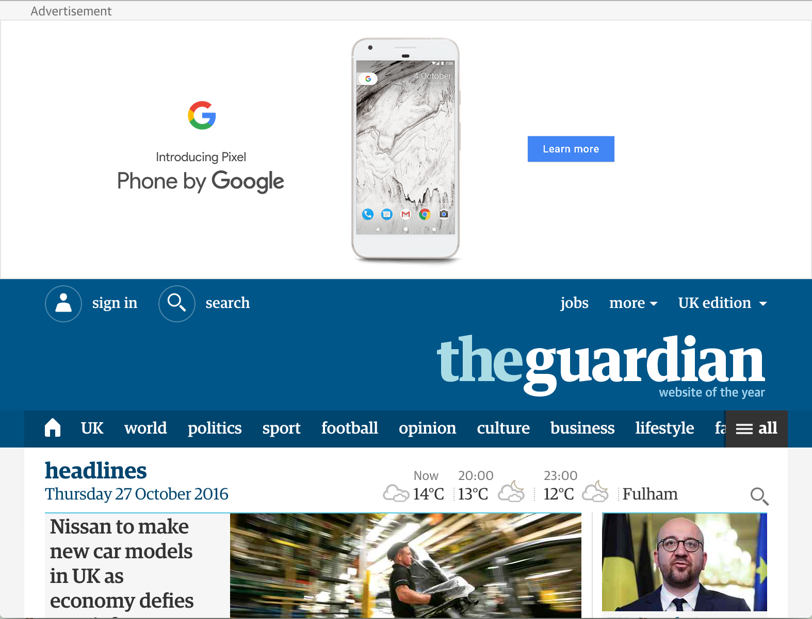

% Hack and Remix the Web with WebExtensions
% Kumar McMillan, Luca Greco
% 2016

#

Hack and Remix the Web with WebExtensions

* You'll need Firefox 49
* Example code from USB drive
* http://bit.ly/web-ext-mozfest

#

Optional installs

* npm install web-ext
* Firefox Developer Edition

#

Agenda

* Working session
* Build WebExtensions
  * laptop
  * code editor
  * example code

#

Rules

1. Have fun
2. Be respectful

# 

# 

# 

#

We are here to help

#

Let's look at the example code
